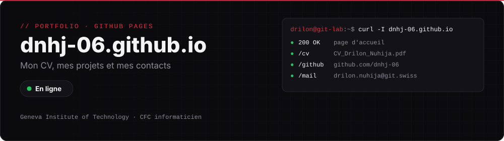

  
  

# Mon portfolio

Petite page perso qui regroupe mon CV, mes projets et mes contacts. C'est la page qui s'ouvre quand on scanne le QR code de mon CV.

**👉 [dnhj-06.github.io](https://dnhj-06.github.io)**

| Fichier | Rôle |
|---|---|
| `index.html` | la page d'accueil (HTML et CSS, sans framework) |
| `CV_Drilon_Nuhija.pdf` | mon CV à télécharger |

---

[← Retour à mon profil](https://github.com/dnhj-06)
